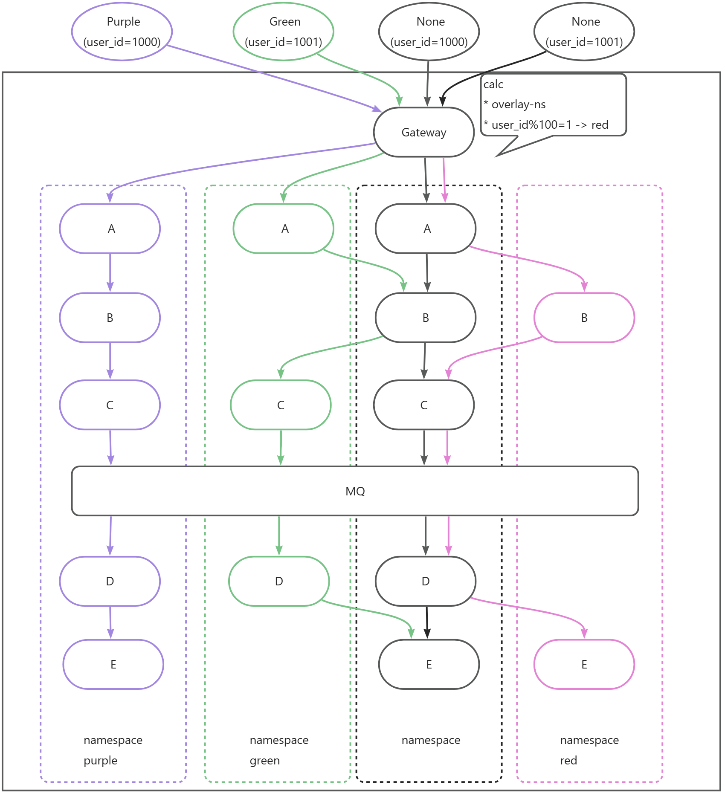

# Overlay Namespace

## Concept

An **Overlay Namespace** is a label-affinity-based service discovery and resource configuration mechanism. It adds specific labels to selected service instances within an existing cluster, forming a logically isolated "overlay layer," while unlabeled instances serve as the default fallback. This mechanism uniformly applies across service invocation, message consumption, scheduled tasks, and other scenarios, and supports hierarchical configuration loading.

**Service Discovery Strategy**

+ **Unlabeled requests**: Routed exclusively to default instances, ensuring baseline namespace isolation.
+ **Labeled requests**: Prefer instances matching the label; if none are available, safely fall back to default instances.

**Configuration Loading Strategy**

+ **Unlabeled services**: Load configuration only from the default namespace.
+ **Labeled services**: Prefer configuration from the current overlay namespace; missing entries automatically fall back to the default namespace, achieving a "override + inherit" semantic.

This mechanism enables lightweight namespace partitioning such as for canary releases, testing environments, or zone-based routing without requiring physical isolation, while ensuring high availability and consistent cross-component behavior.

This implementation enables the creation of a logically isolated new namespace effectively a lightweight "cluster" by simply adding a small number of labeled service instances on top of the base services. This mechanism closely resembles OverlayFS, which constructs a new image by overlaying a minimal set of file layers onto a base image. Hence, it is named **Overlay Namespace**.

---

## Workflow Example

Assume the system has a default namespace (Black, i.e., the primary namespace) and three overlay namespaces: Purple, Green, and Red. Namespace labels are uniformly injected and propagated by the Gateway and carried throughout the entire service call chain.

Behavior in each scenario:

+ **Purple Namespace**  
The upstream request carries the `Purple` namespace label, which the Gateway propagates downstream. Since the Purple namespace has a full set of service instances deployed, all requests are handled entirely within this namespace with no fallback to the default.
+ **Green Namespace**  
The upstream request carries the `Green` label, propagated by the Gateway. As Green only hosts a subset of services, routing follows these rules: 
    - If the target service exists in Green → route to the Green instance. 
    - If the target service is absent in Green → automatically fall back to the default namespace instance.
+ **Black (Default) Namespace**  
The upstream request carries no namespace label, and the `user_id` does not match the `user_id % 100` traffic-splitting rule. The request enters the default namespace and is strictly confined to it never accessing any overlay namespace instances.
+ **Red Namespace (Rule-Triggered)**  
The upstream request carries no namespace label, but the `user_id` matches the `user_id % 100` splitting rule. The Gateway automatically injects the `Red` label. Subsequent behavior mirrors Green: 
    - If the service exists in Red → route to the Red instance. 
    - If missing in Red → fall back to the default namespace instance.

---

**Similar mechanism**

| Product | Implementation | Usage |
| --- | --- | --- |
| **Kubernetes** | Topology | • Configure `topologyKeys`in Service    • Match based on labels of the requesting Pod and target service    • Explicit rules can enable fallback to all endpoints |
| **Istio** | DestinationRule + Subset | • Tag service instances using subsets    • VirtualService routes requests to specific subsets based on content    • Explicit fallback rules to specific instances supported |
| **Consul** | Intentions with Service Tags | • Tag service instances    • Requests can specify `?tag=prod`to target tagged instances    • **No automatic fallback**: request fails if the specified tag doesn't exist |
| **Spring Cloud LoadBalancer** | ApiVersion | • Services declare an `API_VERSION` attribute    • Match the information in the request with the target service attribute information    • Configurable fallback to all instances |
| | HintBased | • Services declare a `hint` attribute    • Match request context to service hints    • Fallback to all instances |
| | RequestBasedStickySession | • Match cookie in request to service instance ID    • Fallback to all instances |
| | Subset | • Select a subset of service instances dynamically |
| | ZonePreference | • Services declare a `zone` attribute    • Match caller's zone with target service's zone    • Fallback to all instances |

   

